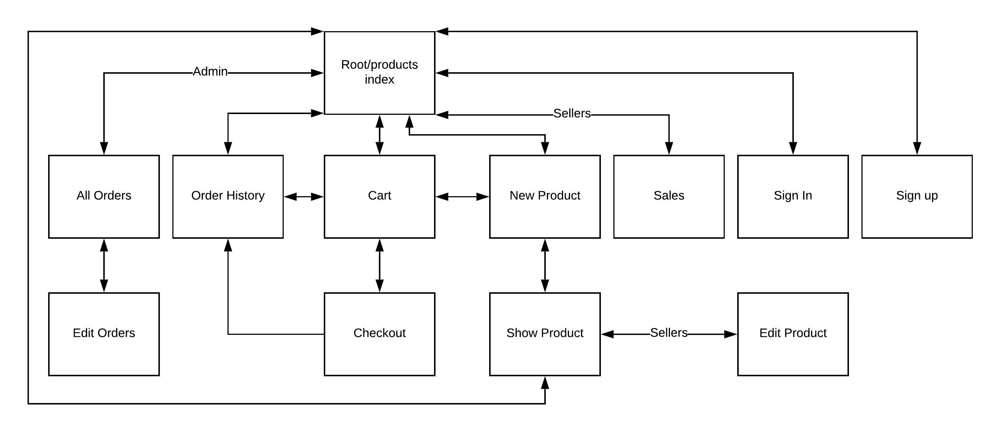

[Github Repo](https://github.com/davidkerr766/weight-it-out)

[Deployed App]( https://weight-it-out.herokuapp.com/)

# The Problem Solved by This App and Why It Needs Solving
The problem that this app solves has arisen from the COVID-19 pandemic.  Gyms have been shut down for months.  This leads to two problems.  Gym goers can only train at home with the limited equipment they have.  This has increased the demand for home gym equipment and lead to equipment being sold out in most stores or the price has been prohibitively inflated.  Gym goers need gear to train at home and they can’t get it.  They also only need the equipment while restrictions are still in effect and gyms are closed.
The second problem is from the perspective of gym owners.  While restrictions are in place a gym owner has gym equipment just sitting there unused.  If they financed the equipment, they still must make repayments and they still must pay rent for the gym building.  A gym owner would be able to offset some of their overhead costs if they could hire out their unused gym equipment while restrictions are still in effect.
# Weight It Out
#### Purpose
The purpose of the Weight It Out two-way marketplace app is to solve the problems mentioned above for both Gym goers and gym owners.  A Gym goer can find equipment on Weight It Out and hire it a month at a time.  This means they don’t waste money buying equipment they only need temporarily.  Gym owners can list equipment for rent on Weight It Out that would otherwise sit there unused during restrictions and at least make some money.
#### Features
* Index of all products, can be filtered by category and search by name
* Users can sign in
* Any signed in user can list gym equipment for rental, making them a seller and granting access to the sellers dashboard
* A sales dashboard showing all sellers products, number of rentals, stock remaining, total revenue and revenue by category
* A renter can add any number of products to a cart that will persist between logins until it is paid
* Quantity of items in a cart can be added or subtracted or deleted completely
* Renters can purchase the content of their cart with stripe
* Stock quantities are updated on successful purchase of cart
* A renter can see a history of their past orders
* Admins can edit and delete any order/cart or product

#### Sitemap

#### Screenshots

#### Target Audience
The target audience for Weight It Out is:
* Anyone that owns gym equipment to rent.  Particularly gym owners
* Anyone that needs gym equipment while gyms are closed
#### Tech Stack
* Ruby 2.5.1

	Gems:
	* devise
	* stripe
	* rolify
	* aws-sdk-s3
	* activestorage-validator
	* semantic-ui-sass
	* chartkick
	* pg_search
* Ruby on Rails 6.0.3
* Postgres 12.3
* HTML 5
* SCSS
* Javascript

## User Stories !!
[Trello](https://trello.com/b/bqyWmgto/weight-it-out)
## Wireframes !!

## ERD !!

## High Level Components in App !!

## Third Party Services !!

## Models Active Record Associations !!

## Database Relations !!

## Database Schema

## How Tasks were allocated and tracked !!
[Trello](https://trello.com/b/bqyWmgto/weight-it-out)
