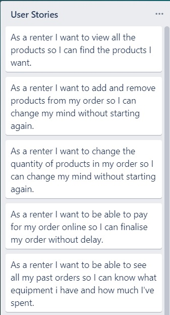
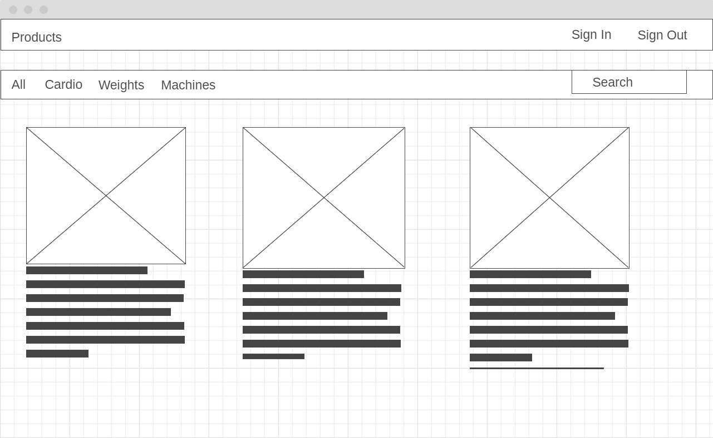
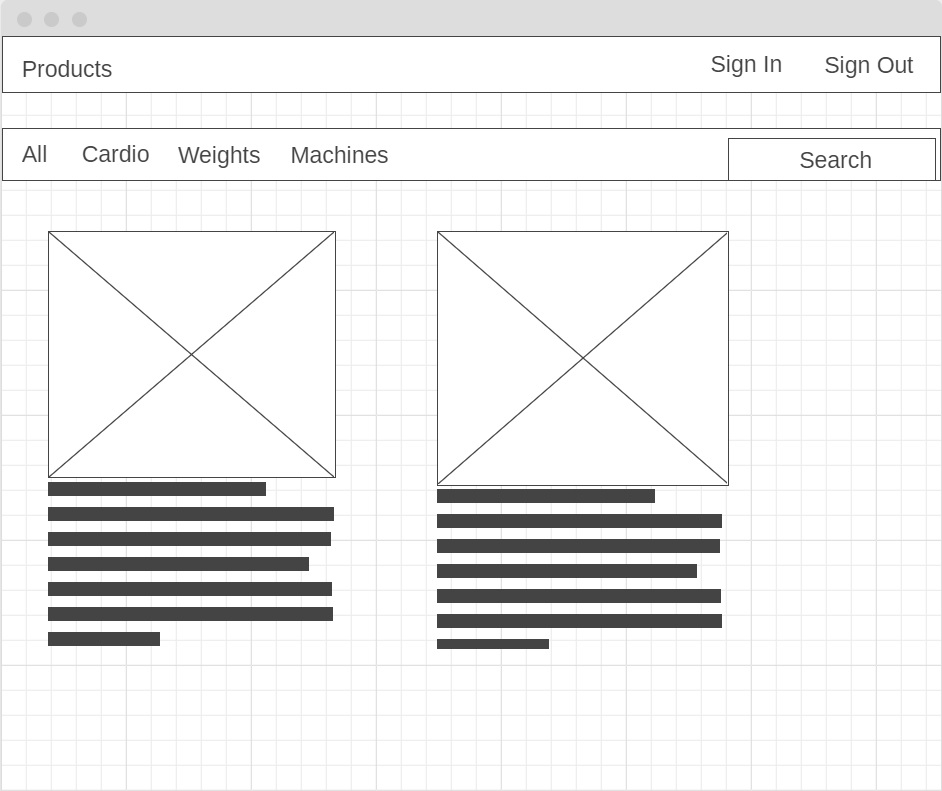
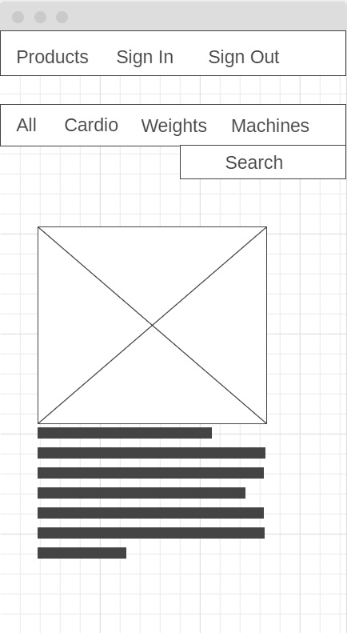
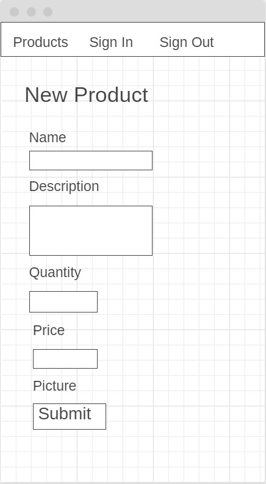
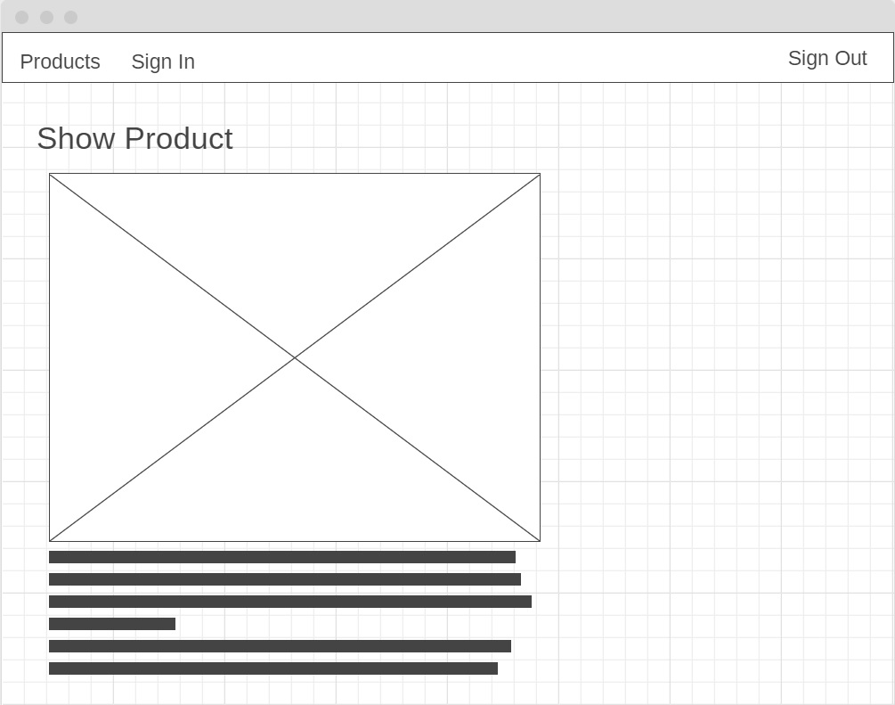
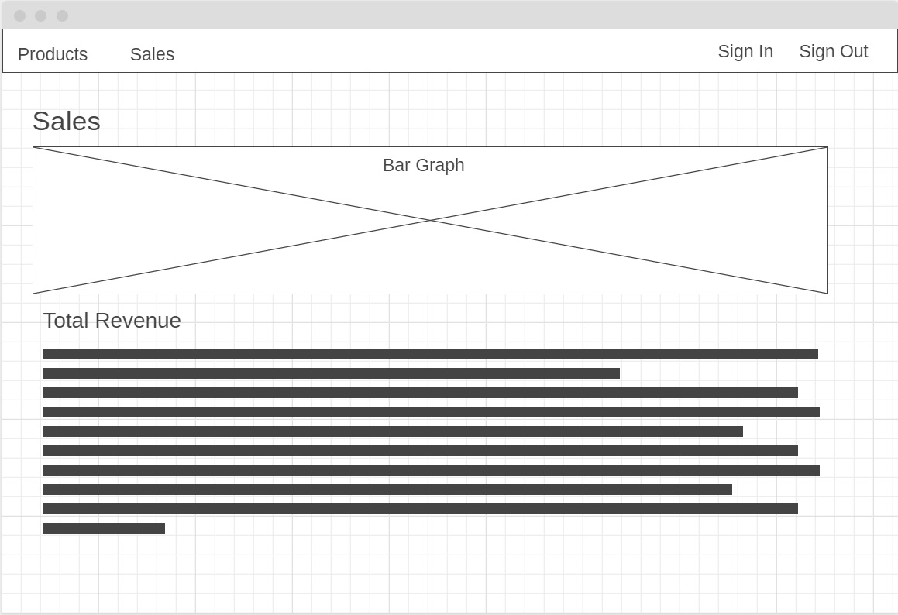
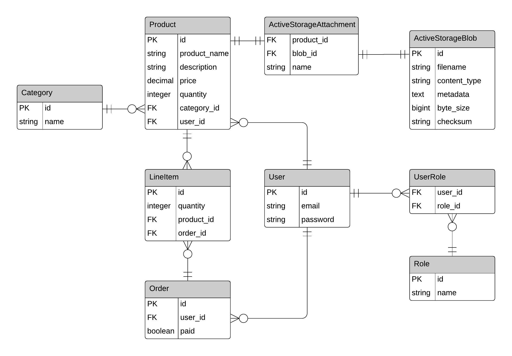
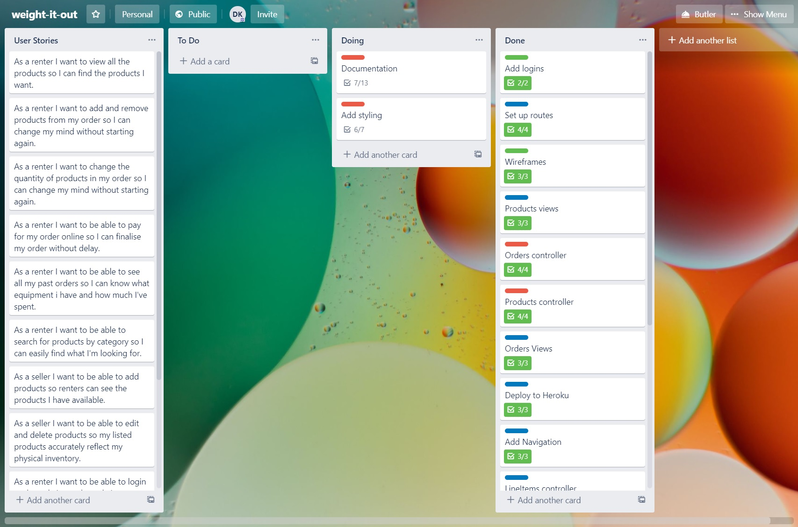
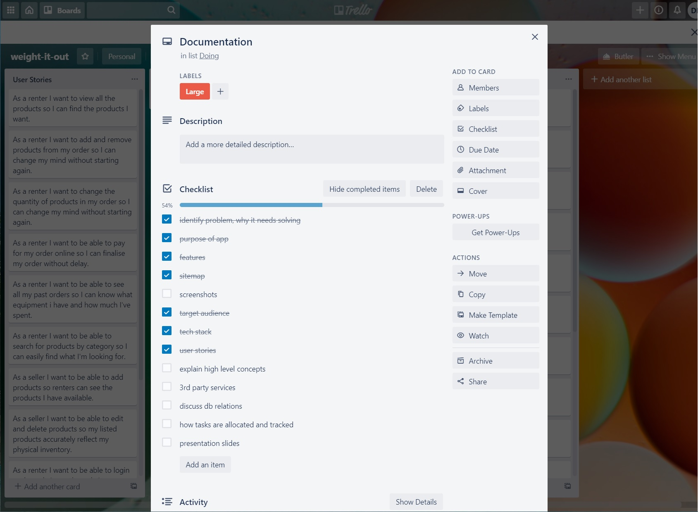

[Github Repo](https://github.com/davidkerr766/weight-it-out)

[Deployed App]( https://weight-it-out.herokuapp.com/)

# The Problem Solved by This App and Why It Needs Solving
The problem that this app solves has arisen from the COVID-19 pandemic.  Gyms have been shut down for months.  This leads to two problems.  Gym goers can only train at home with the limited equipment they have.  This has increased the demand for home gym equipment and lead to equipment being sold out in most stores or the price has been prohibitively inflated.  Gym goers need gear to train at home and they can’t get it.  They also only need the equipment while restrictions are still in effect and gyms are closed.

The second problem is from the perspective of gym owners.  While restrictions are in place a gym owner has gym equipment just sitting there unused.  If they financed the equipment, they still must make repayments and they still must pay rent for the gym building.  A gym owner would be able to offset some of their overhead costs if they could hire out their unused gym equipment while restrictions are still in effect.
# Weight It Out
#### Purpose
The purpose of the Weight It Out two-way marketplace app is to solve the problems mentioned above for both Gym goers and gym owners.  A Gym goer can find equipment on Weight It Out and hire it a month at a time.  This means they don’t waste money buying equipment they only need temporarily.  Gym owners can list equipment for rent on Weight It Out that would otherwise sit there unused during restrictions and at least make some money.
#### Features
* Index of all products, can be filtered by category and search by name
* Users can sign in
* Any signed in user can list gym equipment for rental, making them a seller and granting access to the sellers dashboard
* A sales dashboard showing all sellers products, number of rentals, stock remaining, total revenue and revenue by category
* A renter can add any number of products to a cart that will persist between logins until it is paid
* Quantity of items in a cart can be added or subtracted or deleted completely
* Renters can purchase the content of their cart with stripe
* Stock quantities are updated on successful purchase of cart
* A renter can see a history of their past orders
* Admins can edit and delete any order/cart or product

#### Sitemap

#### Screenshots

#### Target Audience
The target audience for Weight It Out is:
* Anyone that owns gym equipment to rent.  Particularly gym owners
* Anyone that needs gym equipment while gyms are closed
#### Tech Stack
* Ruby 2.5.1

	Gems:
	* devise
	* stripe
	* rolify
	* aws-sdk-s3
	* activestorage-validator
	* semantic-ui-sass
	* chartkick
	* pg_search
* Ruby on Rails 6.0.3
* Postgres 12.3
* HTML 5
* SCSS with semantic-ui
* Javascript
* Git
* Trello
* Lucidchart

## User Stories


[Trello](https://trello.com/b/bqyWmgto/weight-it-out)
## Wireframes
Products index for desktop

Products index for tablet


Products index for mobile



New product for mobile



Show product for tablet

Sales for Desktop


## ERD


## High Level Components in App
Weight It Out is built using Ruby on Rails.  Ruby on Rails uses the Model-view-controller (MVC) pattern to separate the concerns of a complex web framework.  The Model is concerned with data and associated logic, the View is everything shown to the user and the Controller acts like a brain, receiving commands from a user and then interacts with the model and Views to complete the commands.

The specific implementation of MVC in Rails and indeed in Weight It Out, follows a path of interactions between model, view and controller.  When HTTP requests are made, they are routed to specific controllers using RESTful URL’s.  Weight It Out has controllers for products, orders and lineitems.  The specific route will determine what action method is called in the controller.  For example, if the HTTP request is routed to the index of the products controller, the index action method will be called.  The controller can then communicate with either the model, view or both depending on what is required in the action.  In the index example, both the model and view are required.  The index action shows all the available products.  Rails uses the model, more specifically Activerecord, as an interface with the database.  The database is queried by the product model, with the model handling all query logic.  The model then provides the data back to the controller.  The user needs to see the data provided by the model so the controller passes the data as a variable to the view.  The rails view can then generate the necessary html and css ready to send back to the user’s browser using the data provided by the controller.  In the index example rails will send the index page displaying all the products. 

## Third Party Services
#### AWS S3
AWS s3 is used to store all product images.  AWS s3 is a cloud file storage solution that enables images to served by AWS servers and therefore free up resources on the rails server.  An Amazon AWS account was made and an Identity and Access Management (IAM) user was set up with permissions to add and delete files in a new s3 bucket.  Thy s3 bucket is specific for the application and can only be used with the IAM user credentials.  The IAM user credentials are stored in an encrypted file in the rails app to prevent unauthorised access to the s3 bucket.
#### Stripe
Stripe is used by the application to handle credit card payments.  By using Stripe, the app does not need to handle any credit card information or be PCI compliant.  A Stripe account was set up for the app with private and public keys generated.  The keys are stored in the app in an encrypted file.  The private key is only ever used server side to prevent it being exposed to the public.  Stripe provided a gem to use with rails.  With methods provided from the gem, a session object is generated in a rails controller.  The public key is in a rails view.  If the user decides to pay with stripe they are redirected to the Stripe website to handle the credit card payment.  Stripe verifies the payment request is authentic by matching the public key provided from the front end with the session object generated with the secret key server side.
#### Heroku
Heroku is used to deploy the rails application online.  Heroku is a cloud hosting service with wide support for Ruby on Rails apps.  Heroku also has an integrated Postgres database making it an ideal choice.  Heroku serves the rails app on a virtual instance of Linux they call a dyno.  The dyno has a virtualised operating system with all required software installed to run the rails app.  Heroku is compatible with git, functioning as a remote repository.  This allows the app to be pushed to Heroku through the CLI using git.  Heroku stores all data in its own Postgres database.  A master key is provided to Heroku as an environment variable to allow decryption of credentials in the app.

## Models Active Record Associations
Weight it out has the following model relationships:
* Category
    * has_many :products, dependent: :destroy.  
* LineItem
	* belongs_to :product
  	* belongs_to :order
* Order
	* belongs_to :user
	* has_many :line_items, dependent: :destroy
	* has_many :products, through: :line_items
* Product
	* belongs_to :category
	* belongs_to :user
	* has_many :line_items, dependent: :destroy
	* has_many :orders, through: :line_items
	* has_one_attached :picture
* Role
	* has_and_belongs_to_many :users, :join_table => :users_roles
* User
	* has_many :products, dependent: :destroy
	* has_many :orders, dependent: :destroy
	* Rolify

**has_many**: Establishes a has many relationship with the model given as an argument.  For example the category model has many products.  With this relationship in place active record allows a Category object to be queried for all the products it owns with a class method called “products”.  Products will return all the products that have a category_id (foreign key) that matches the id of the category object. The relationship must be established in both directions for active record to recognise it.  Therefore, product must “belongs_to” category to establish the relationship.

**belongs_to**:  Is the reciprocal of has_many and completes the active record association.  A model that belongs_to another will have a foreign key for a single model object in the parent model.  When a model, such as product in the app, belongs to another model it can only have one object of that model associated with it.  For example, a product has one category.  The belongs_to association also gives the model a class method to return the object of the model it belongs to.  Product.find(1).category will return the category object of the product with an id of 1.

**has_many :objects, through :model**: Is the model association used to establish a many to many relationship through a join table in active record.  The join table will have two belongs_to relations, representing two foreign keys.  The join table is the model referred to with “through”.  For example in the app an Order has_many :products, through: :line_items.   A product also has_many :orders, through: :line_items.  With these model associations in place an active record many to many association is established between Orders and Products with line_items acting as a join table.

**has_one_attached**: Is the active storage equivalent of has_one in active record.  It establishes a has one and only one relationship with an active storage blob object.  Product has_one_attached :picture meaning one and only one picture(active storage blob) belongs to the product.

**has_and_belongs_to_many**: Is another active record association to establish a many to many record.  However, with has_and_belongs_to_many active record with make it’s own join table without having to explicitly make a model for the join table.  In the app Role HABTM users and User HABTM roles (this relation is declared with rolify in the user model).

## Database Relations
#### User
User is a parent table.  The Business rules for User state that a user can have none or many Roles through the UserRole join table.  A User can have none or many Orders.  A User can also have none or many Products.
#### Category
Category is a parent table and functions as a lookup table.  A Category can have none or many products.  Category was established to normalise the product table and remove repeated data that a field for category in products would provide.
#### Role
Role is a parent table.  A role has none or many Users through UserRoles.  In typical use of the app a role would only be created when assigned to a user making a Role usually have one or many Users.  However, A Role can be created independently in the rails console allowing a role to have no Users.
#### UserRole
UserRole is a child of Users and Roles acting as a join table to establish a many to many relationship between Users and Roles.  A UserRole can have one and only one Role.  A UserRole can have one and only one User.
#### Order
Order is a child of User.  An Order can have one and only one User.  An order can have none or many Products through LineItems.  Typically, an order will have one or many products through lineitems as in the application an order is only ever initialised when a product is added through lineitems.  However, within the app the user can delete all lineitems from an order allowing an order to have none or many products through lineitems.
#### LineItem
Line item is a child of Orders and Products and acts as a join table establishing a many to many relationship between Products and Orders.  A lineItem can have one and only one Order.  A lineitem can have one and only one Product.
#### Product
Product is a child of Category and User.  A Product has one and only one Category.  A Product has none or many Orders through the join table LineItems.  A product has one and only one User (the owner of the product who listed it for rent).  A Product has one and only one picture, stored as a blob in ActiveStorageBlob.
#### ActiveStorageAttachment
ActiveStorageAttachment is a child of Products and ActiveStorageBlog and would be acting as a join table if Products had many pictures.  However, it is a redundant table in the Weight It Out app.  When active storage is installed it creates the table to allow for the possibility of many files belonging to one model.  ActiveStorageAttachment has one and only one Product.  ActiveStorageAtachment has one and only one ActiveStorageBlog.
#### ActiveStorageBlob
ActiveStorageBlob is a parent table and has a one to one relationship to Products through ActiveStorageAttachment.  ActiveStorageBlob has one and only one ActiveStorageAttachment.  ActiveStorageBlob has one and only one Product through ActiveStorageAttachment.   A Product must have a picture is a business rule of the app.

## Database Schema
```
ActiveRecord::Schema.define(version: 2020_05_14_224844) do
  enable_extension "plpgsql"

  create_table "active_storage_attachments", force: :cascade do |t|
    t.string "name", null: false
    t.string "record_type", null: false
    t.bigint "record_id", null: false
    t.bigint "blob_id", null: false
    t.datetime "created_at", null: false
    t.index ["blob_id"], name: "index_active_storage_attachments_on_blob_id"
    t.index ["record_type", "record_id", "name", "blob_id"], name: "index_active_storage_attachments_uniqueness", unique: true
  end

  create_table "active_storage_blobs", force: :cascade do |t|
    t.string "key", null: false
    t.string "filename", null: false
    t.string "content_type"
    t.text "metadata"
    t.bigint "byte_size", null: false
    t.string "checksum", null: false
    t.datetime "created_at", null: false
    t.index ["key"], name: "index_active_storage_blobs_on_key", unique: true
  end

  create_table "categories", force: :cascade do |t|
    t.string "name"
    t.datetime "created_at", precision: 6, null: false
    t.datetime "updated_at", precision: 6, null: false
  end

  create_table "line_items", force: :cascade do |t|
    t.integer "quantity", default: 1
    t.bigint "product_id", null: false
    t.bigint "order_id", null: false
    t.datetime "created_at", precision: 6, null: false
    t.datetime "updated_at", precision: 6, null: false
    t.index ["order_id"], name: "index_line_items_on_order_id"
    t.index ["product_id"], name: "index_line_items_on_product_id"
  end

  create_table "orders", force: :cascade do |t|
    t.boolean "paid", default: false
    t.bigint "user_id", null: false
    t.datetime "created_at", precision: 6, null: false
    t.datetime "updated_at", precision: 6, null: false
    t.index ["user_id"], name: "index_orders_on_user_id"
  end

  create_table "products", force: :cascade do |t|
    t.string "product_name"
    t.string "description"
    t.decimal "price", precision: 8, scale: 2, default: "0.0"
    t.integer "quantity", default: 1
    t.bigint "category_id", null: false
    t.bigint "user_id", null: false
    t.datetime "created_at", precision: 6, null: false
    t.datetime "updated_at", precision: 6, null: false
    t.index ["category_id"], name: "index_products_on_category_id"
    t.index ["user_id"], name: "index_products_on_user_id"
  end

  create_table "roles", force: :cascade do |t|
    t.string "name"
    t.string "resource_type"
    t.bigint "resource_id"
    t.datetime "created_at", precision: 6, null: false
    t.datetime "updated_at", precision: 6, null: false
    t.index ["name", "resource_type", "resource_id"], name: "index_roles_on_name_and_resource_type_and_resource_id"
    t.index ["resource_type", "resource_id"], name: "index_roles_on_resource_type_and_resource_id"
  end

  create_table "users", force: :cascade do |t|
    t.string "email", default: "", null: false
    t.string "encrypted_password", default: "", null: false
    t.string "reset_password_token"
    t.datetime "reset_password_sent_at"
    t.datetime "remember_created_at"
    t.datetime "created_at", precision: 6, null: false
    t.datetime "updated_at", precision: 6, null: false
    t.index ["email"], name: "index_users_on_email", unique: true
    t.index ["reset_password_token"], name: "index_users_on_reset_password_token", unique: true
  end

  create_table "users_roles", id: false, force: :cascade do |t|
    t.bigint "user_id"
    t.bigint "role_id"
    t.index ["role_id"], name: "index_users_roles_on_role_id"
    t.index ["user_id", "role_id"], name: "index_users_roles_on_user_id_and_role_id"
    t.index ["user_id"], name: "index_users_roles_on_user_id"
  end

  add_foreign_key "active_storage_attachments", "active_storage_blobs", column: "blob_id"
  add_foreign_key "line_items", "orders"
  add_foreign_key "line_items", "products"
  add_foreign_key "orders", "users"
  add_foreign_key "products", "categories"
  add_foreign_key "products", "users"
end
```
## How Tasks were allocated and tracked
[Trello](https://trello.com/b/bqyWmgto/weight-it-out)
Tasks were planned and allocated using Trello.  The first part of the process was to make the user stories.  The User stories then determined what tasks would be necessary.  A column for tasks To Do, Doing and Done was made in Trello.  Then Tasks were allocated to satisfy the requirements of the user stories and the assessment criteria.  For each task the time required to complete was assessed and the task was allocated a colour coded rating.  Next the task was broken down into a checklist that could be ticked off after completion.  When a task was being worked on it was moved to the Doing column and finally moved to the Done column when finished.

